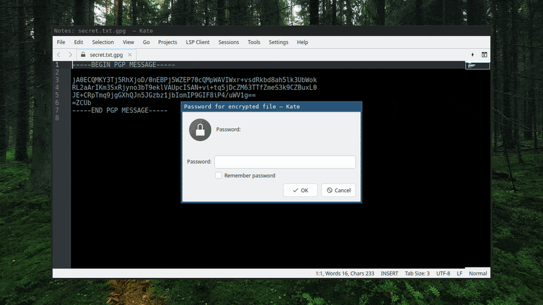

# Kate GPG Password Plugin

Transparent **password-based (symmetric) encryption** for [Kate](https://kate-editor.org/) and other KTextEditor apps. Open an encrypted file, type a password, edit it like any other document, and it's re-encrypted on save. No keyrings, no key management — just a password.

Files are written as ASCII-armored OpenPGP (AES-256), so they're **compatible with [Encrypted Notepad II](https://github.com/ivoras/EncryptedNotepad2)** — available for **Windows, Linux, and Android** ([binaries](https://payhip.com/b/q9s7S), or [build from source](https://github.com/ivoras/EncryptedNotepad2); macOS/iOS only if there's demand). Edit the same encrypted note on your phone and your desktop.

> **Not the same as Kate's built-in GPG plugin** — see [How this differs](#how-this-differs-from-kates-built-in-gpg-plugin) below.



## Features

- Transparent decrypt on open for `.gpg` / `.pgp` files, or any file starting with `-----BEGIN PGP MESSAGE-----`.
- Re-encrypts on normal Save / Save As — the editor keeps showing plaintext; only the file on disk is encrypted. Encryption happens **before** Kate writes, so plaintext is never written to the target file on any save path.
- **File → Set Encryption Password** to turn any plaintext document into an encrypted one.
- Symmetric OpenPGP, ASCII-armored, AES-256 — interoperable with GnuPG (`gpg -d file.gpg`) and Encrypted Notepad II.
- **Legacy import** of Notepad3 / NotepadCrypt encrypted files (read-only; saving migrates the file to the stronger GPG format). See the security notes — the Notepad3 format is weak.

## How this differs from Kate's built-in GPG plugin

Since version 25.12, Kate bundles its own GPG plugin (originally [dennis2society/kate-gpg-plugin](https://github.com/dennis2society/kate-gpg-plugin), now part of [Kate](https://apps.kde.org/kate/)). It's a fine plugin — but it solves a different problem:

| | **Kate's built-in plugin** | **This plugin** |
|---|---|---|
| Primary model | **Key-centric** — encrypt to OpenPGP **recipients / keys** | **Password-only** — symmetric passphrase, no keys |
| Key management | You manage a GPG keyring (`~/.gnupg`) | None — nothing to manage |
| After save | Buffer shows the **ciphertext**; decrypt again to keep editing | Buffer **keeps showing plaintext** — edit continuously |
| Decryption secret | A private key **stored on disk** | A passphrase that **only lives in your head** |
| Legacy formats | — | Imports Notepad3 / [Encrypted Notepad II](https://github.com/ivoras/EncryptedNotepad2) |

Use Kate's built-in plugin to encrypt files *for other people*, to their OpenPGP keys. Use this one for a personal, password-locked note: nothing to manage, and it stays readable while you edit. (Kate's plugin *can* do symmetric too, but it isn't built around it.)

> **Don't enable both plugins at once.** They hook the same document signals (`aboutToSave`, decrypt-on-open) for the same `.gpg`/`.asc` files and both rewrite the buffer, so on a shared file you'll get competing decrypt prompts and competing re-encryption on save — risking double-encryption or corruption. Enable whichever one matches your workflow, not both.

## Threat model: secrets vs. a compromised agent on your own machine

Picture a now-common setup: an **AI coding agent — or any process — running with broad access to your machine**. A malicious prompt, or plain malware, gets it to hunt for your secrets and upload them somewhere.

The difference that matters is **where the decryption secret lives:**

- With **key-based** encryption, the private key sits in `~/.gnupg`. If its passphrase is empty or cached in `gpg-agent` (common, for convenience), anything that can read your files and run `gpg` can **decrypt everything at rest** — silently, while you're away.
- With this plugin's **password-only** model, the passphrase is **never written to disk** (it's piped to `gpg` over stdin, never a temp file, and symmetric caching is disabled with `--no-symkey-cache`). An adversary with full read access to your filesystem sees only **ciphertext** and has nothing to decrypt it with. A prompt-injected agent told to "find and upload my secrets" gets opaque `.gpg` blobs.

**To get past this, an attacker has to escalate from a passive file read to active, real-time surveillance** (see the limits below). The protection isn't absolute, but it raises the bar a lot: your notes stay safe **at rest** even against an adversary that already has full disk and shell access, and they're exposed only in the moments you actively decrypt them.

Honest limits — this plugin does **not** defend against:

- A **keylogger** capturing the passphrase as you type.
- Reading **Kate's process memory** (the plaintext is in RAM while the file is open).
- Kate's own crash-recovery **swap file** (`.kate-swp`), which holds the unencrypted buffer while you edit — closable with a one-time Kate setting (disable it, or redirect it to RAM); see [Closing the Kate swap-file leak](SECURITY.md#closing-the-kate-swap-file-leak).
- An adversary that **modifies the plugin or Kate itself**.

In short: it turns "read a file" into "install a keylogger and wait." For an agent that's been tricked into exfiltrating data, that's a meaningful wall.

## Requirements

- Kate / KTextEditor (KF6) and Qt 6.6+
- The `gpg` (GnuPG) command-line tool on `PATH`
- Build: CMake, Extra CMake Modules (ECM), KF6 dev packages, OpenSSL dev

## Build & install

```bash
cmake -S . -B build -G Ninja
cmake --build build
sudo cmake --install build
```

Restart Kate, then enable it in **Settings → Configure Kate → Plugins → GPG Password Files**.

On Ubuntu/Debian the build dependencies are roughly:

```bash
sudo apt install cmake ninja-build extra-cmake-modules \
  libkf6texteditor-dev libkf6xmlgui-dev libkf6i18n-dev \
  libkf6coreaddons-dev libkf6widgetsaddons-dev libssl-dev
```

## Security

This is encryption software — please read [SECURITY.md](SECURITY.md) before trusting it with real secrets. Highlights:

- New files use OpenPGP symmetric encryption (AES-256, salted+iterated S2K) via `gpg`.
- The passphrase is passed to `gpg` over stdin (never argv or a temp file) and symmetric passphrase caching is disabled.
- **Notepad3 import is legacy-compatibility only**: its key derivation is unsalted single-pass SHA-256 and the format has no integrity check. Files are read-only — saving rewrites them as GPG. Don't use the Notepad3 format for new notes.
- Kate may write a crash-recovery swap file containing decrypted text. See SECURITY.md for the mitigation.

Report vulnerabilities privately — see [SECURITY.md](SECURITY.md).

## License

[MIT](LICENSE) © 2026 Eric Frost. The project is [REUSE](https://reuse.software/)-compliant.
